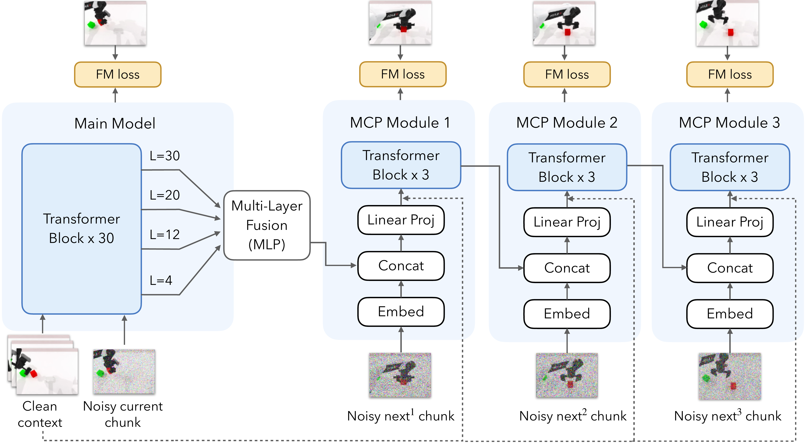
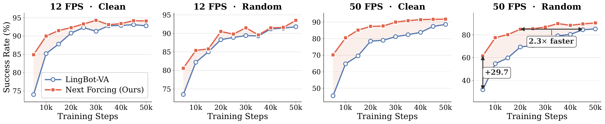
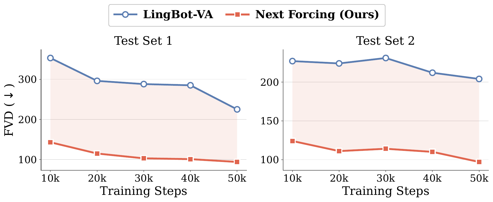

<h1 align="center">Next Forcing:<br>Causal World Modeling with Multi-Chunk Prediction</h1>

<p align="center">
  <strong>
    Gangwei Xu<sup>1,2</sup> &nbsp;
    Qihang Zhang<sup>1</sup> &nbsp;
    Jiaming Zhou<sup>1,4</sup> &nbsp;
    Xing Zhu<sup>1</sup>
    Yujun Shen<sup>1</sup> &nbsp;
    Xin Yang<sup>2</sup> &nbsp;
    Yinghao Xu<sup>3,1</sup>
  </strong>
    <sup>1</sup>Robbyant, Ant Group &nbsp;
    <sup>2</sup>HUST &nbsp;
    <sup>3</sup>HKUST &nbsp;
    <sup>4</sup>HKUST (GZ)
  </p>

<p align="center">
  <a href="https://gangweix.github.io/next-forcing/"></a>
  <a href="https://arxiv.org/pdf/2606.11187"></a>
  <a href="https://github.com/gangweix/next-forcing"></a>
</p>

## Overview

Next Forcing tackles the myopic supervision problem in autoregressive video world models: next-chunk denoising often learns local appearance shortcuts instead of long-range dynamics, especially at high frame rates.

By training lightweight Multi-Chunk Prediction (MCP) modules to predict multiple future chunks, Next Forcing provides denser temporal supervision, achieves faster and more stable convergence across frame rates, sets new state-of-the-art results on RoboTwin, and enables `2x` inference acceleration via parallel chunk generation.

## Highlights

- **Multi-Chunk Prediction (MCP):** auxiliary modules predict `next^1`, `next^2`, and `next^3` chunks to provide long-range temporal supervision beyond the current chunk.
- **Faster and stable training:** Next Forcing converges faster and reaches higher success rates across frame rates, with the strongest gains at high FPS where appearance shortcuts are most severe.
- **LLM-style inference acceleration:** the MCP module can be retained at inference to predict the next chunk in parallel with the current chunk, similar in spirit to parallel/speculative decoding in LLMs.

## Method

<p align="center">
  
</p>

During training, the main model denoises the current chunk, while lightweight MCP modules predict multiple future chunks through a causal chain. These future prediction losses provide dense temporal supervision to the backbone and encourage the model to learn long-range dynamics instead of local appearance shortcuts.

The same trained checkpoint supports two inference modes:

- **Zero-overhead mode:** remove MCP modules and run the main model exactly like the baseline.
- **MCP-accelerated mode:** keep the first MCP module so one autoregressive step produces both the current chunk and the next chunk.

## Results

### Training Convergence

<p align="center">
  
</p>

Next Forcing converges faster than LingBot-VA across frame rates. The gain is most pronounced at `50 fps`: on the Random setting, Next Forcing reaches LingBot-VA's `45k`-step accuracy at only `20k` steps, corresponding to `2.3x` faster convergence.

### Final RoboTwin Accuracy

Next Forcing achieves the best average success rate on the RoboTwin benchmark across 50 bimanual manipulation tasks.

| Setting | X-VLA | pi_0 | pi_0.5 | Motus | Being-H0.7 | Fast-WAM | LingBot-VA | **Next Forcing** |
| --- | ---: | ---: | ---: | ---: | ---: | ---: | ---: | ---: |
| Clean | 72.9 | 65.9 | 82.7 | 88.7 | 90.2 | 91.9 | 92.9 | **94.1** |
| Random | 72.8 | 58.4 | 76.8 | 87.0 | 89.6 | 91.8 | 91.5 | **93.5** |

### Inference Acceleration

MCP-accelerated inference predicts the next video chunk in parallel with the current chunk, reducing sequential video denoising cost while preserving comparable accuracy.

| Inference Mode | 12 fps Clean | 12 fps Random | 25 fps Clean | 25 fps Random | 50 fps Clean | 50 fps Random |
| --- | ---: | ---: | ---: | ---: | ---: | ---: |
| Standard | 94.1 | 93.5 | 92.6 | 91.4 | 91.8 | 90.5 |
| MCP-accelerated (`2x`) | 93.5 | 90.6 | 91.0 | 89.8 | 92.2 | 91.3 |

### PhyWorld

On PhyWorld, Next Forcing improves both video quality and physical consistency over LingBot-VA.

<table>
  <thead>
    <tr>
      <th rowspan="2">Method</th>
      <th colspan="2">FVD (&darr;)</th>
      <th colspan="2">Abnormal Ratio (&darr;)</th>
    </tr>
    <tr>
      <th>OOT</th>
      <th>IT</th>
      <th>OOT</th>
      <th>IT</th>
    </tr>
  </thead>
  <tbody>
    <tr>
      <td>LingBot-VA</td>
      <td align="right">5.3</td>
      <td align="right">3.5</td>
      <td align="right">12%</td>
      <td align="right">3%</td>
    </tr>
    <tr>
      <td><strong>Next Forcing</strong></td>
      <td align="right"><strong>4.7</strong></td>
      <td align="right"><strong>3.2</strong></td>
      <td align="right"><strong>8%</strong></td>
      <td align="right"><strong>2%</strong></td>
    </tr>
  </tbody>
</table>

### General Video Pretraining

On 3.5M in-house general video clips, Next Forcing also improves pure video generation after removing the action stream.

<p align="center">
  
</p>

At `50k` training steps, Next Forcing reduces FVD by `58%` on Test Set 1 (`94` vs. `225`) and by `52%` on Test Set 2 (`97` vs. `204`). It also surpasses LingBot-VA's `50k`-step FVD with only `10k` training steps.

## Project Status

- [x] Project page and demos
- [x] Paper
- [ ] Training and inference code
- [ ] Model checkpoints

## Citation

```bibtex
@article{nextforcing,
  title={Next Forcing: Causal World Modeling with Multi-Chunk Prediction},
  author={Gangwei Xu and Qihang Zhang and Jiaming Zhou and Xing Zhu and Yujun Shen and Xin Yang and Yinghao Xu},
  journal={},
  year={2026}
}
```
