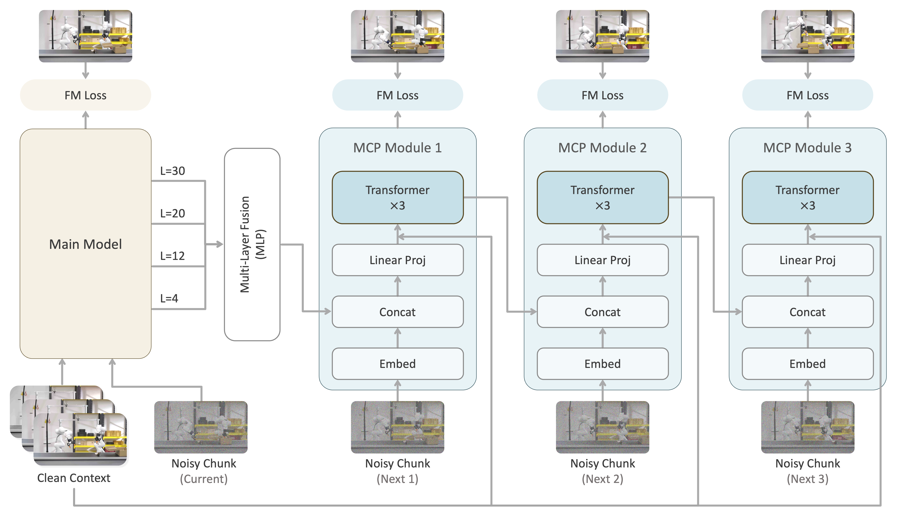

<h1 align="center">Next Forcing:<br>Causal World Modeling with Multi-Chunk Prediction</h1>

<p align="center">
  <strong>
    Gangwei Xu<sup>1,2</sup> &nbsp;
    Qihang Zhang<sup>1</sup> &nbsp;
    Jiaming Zhou<sup>1,4</sup> &nbsp;
    Xing Zhu<sup>1</sup> &nbsp;
    Yujun Shen<sup>1</sup> &nbsp;
    Xin Yang<sup>2</sup> &nbsp;
    Yinghao Xu<sup>3,1</sup>
  </strong>
  <br>
  <sup>1</sup>Robbyant, Ant Group &nbsp;
  <sup>2</sup>HUST &nbsp;
  <sup>3</sup>HKUST &nbsp;
  <sup>4</sup>HKUST (GZ)
</p>

<p align="center">
  <a href="https://gangweix.github.io/next-forcing/"></a>
  <a href="https://arxiv.org/pdf/2606.11187"></a>
  <a href="https://github.com/gangweix/next-forcing"></a>
  <a href="https://huggingface.co/gangweix/next-forcing-base"></a>
  <a href="https://huggingface.co/gangweix/next-forcing-posttrain-robotwin"></a>
  <a href="LICENSE.txt"></a>
</p>

## Overview

Next Forcing tackles the myopic supervision problem in autoregressive video world models: next-chunk denoising often learns local appearance shortcuts instead of long-range dynamics, especially at high frame rates.

By training lightweight Multi-Chunk Prediction (MCP) modules to predict multiple future chunks, Next Forcing provides denser temporal supervision, achieves faster and more stable convergence across frame rates, sets new state-of-the-art results on RoboTwin, and enables `2x` inference acceleration via parallel chunk generation.

## Highlights

- **Multi-Chunk Prediction (MCP):** auxiliary modules predict `next^1`, `next^2`, and `next^3` chunks to provide long-range temporal supervision beyond the current chunk.
- **Faster and stable training:** Next Forcing converges faster and reaches higher success rates across frame rates, with the strongest gains at high FPS where appearance shortcuts are most severe.
- **LLM-style inference acceleration:** the MCP module can be retained at inference to predict the next chunk in parallel with the current chunk, similar in spirit to parallel/speculative decoding in LLMs.

## Method

<p align="center">
  
</p>

During training, the main model denoises the current chunk, while lightweight MCP modules predict multiple future chunks through a causal chain. These future prediction losses provide dense temporal supervision to the backbone and encourage the model to learn long-range dynamics instead of local appearance shortcuts.

The same trained checkpoint supports two inference modes:

- **Zero-overhead mode:** remove MCP modules and run the main model exactly like the baseline.
- **MCP-accelerated mode:** keep the first MCP module so one autoregressive step produces both the current chunk and the next chunk.

> **Note on this release.** The released inference code runs in zero-overhead
> mode: `wan_va/wan_va_server.py` loads the transformer with `disable_mcp=True`,
> so the MCP modules are dropped after loading and generation matches the
> baseline cost. The released checkpoint does contain the trained MCP weights
> (`enable_mcp: true` in `transformer/config.json`), and the MCP-accelerated
> `2x` inference path reported in the paper will be released separately.

## Results

### Training Convergence

<p align="center">
  
</p>

Next Forcing converges faster than LingBot-VA across frame rates. The gain is most pronounced at `50 fps`: on the Random setting, Next Forcing reaches LingBot-VA's `45k`-step accuracy at only `20k` steps, corresponding to `2.3x` faster convergence.

### Final RoboTwin Accuracy

Next Forcing achieves the best average success rate on the RoboTwin benchmark across 50 bimanual manipulation tasks.

| Setting | X-VLA | pi_0 | pi_0.5 | Motus | Being-H0.7 | Fast-WAM | LingBot-VA | **Next Forcing** |
| --- | ---: | ---: | ---: | ---: | ---: | ---: | ---: | ---: |
| Clean | 72.9 | 65.9 | 82.7 | 88.7 | 90.2 | 91.9 | 92.9 | **94.1** |
| Random | 72.8 | 58.4 | 76.8 | 87.0 | 89.6 | 91.8 | 91.5 | **93.5** |

### Inference Acceleration

MCP-accelerated inference predicts the next video chunk in parallel with the current chunk, reducing sequential video denoising cost while preserving comparable accuracy. This mode is not part of the current code release; see the [note above](#method).

| Inference Mode | 12 fps Clean | 12 fps Random | 25 fps Clean | 25 fps Random | 50 fps Clean | 50 fps Random |
| --- | ---: | ---: | ---: | ---: | ---: | ---: |
| Standard | 94.1 | 93.5 | 92.6 | 91.4 | 91.8 | 90.5 |
| MCP-accelerated (`2x`) | 93.5 | 90.6 | 91.0 | 89.8 | 92.2 | 91.3 |

### PhyWorld

On PhyWorld, Next Forcing improves both video quality and physical consistency over LingBot-VA.

<table>
  <thead>
    <tr>
      <th rowspan="2">Method</th>
      <th colspan="2">FVD (&darr;)</th>
      <th colspan="2">Abnormal Ratio (&darr;)</th>
    </tr>
    <tr>
      <th>OOT</th>
      <th>IT</th>
      <th>OOT</th>
      <th>IT</th>
    </tr>
  </thead>
  <tbody>
    <tr>
      <td>LingBot-VA</td>
      <td align="right">5.3</td>
      <td align="right">3.5</td>
      <td align="right">12%</td>
      <td align="right">3%</td>
    </tr>
    <tr>
      <td><strong>Next Forcing</strong></td>
      <td align="right"><strong>4.7</strong></td>
      <td align="right"><strong>3.2</strong></td>
      <td align="right"><strong>8%</strong></td>
      <td align="right"><strong>2%</strong></td>
    </tr>
  </tbody>
</table>

### General Video Pretraining

On 3.5M in-house general video clips, Next Forcing also improves pure video generation after removing the action stream.

<p align="center">
  
</p>

At `50k` training steps, Next Forcing reduces FVD by `58%` on Test Set 1 (`94` vs. `225`) and by `52%` on Test Set 2 (`97` vs. `204`). It also surpasses LingBot-VA's `50k`-step FVD with only `10k` training steps.

More video comparisons and real-world deployment results are available on the
[project page](https://gangweix.github.io/next-forcing/).

## Installation

Use Python 3.10 with a CUDA-enabled PyTorch environment, then install the
project dependencies:

```bash
python -m pip install -r requirements.txt --no-build-isolation
```

RoboTwin evaluation also requires a working RoboTwin 2.0 installation. Follow
the official RoboTwin installation guide:

https://robotwin-platform.github.io/doc/usage/robotwin-install.html

See [INSTALL.md](INSTALL.md) for the exact tested environment (Python 3.10,
PyTorch 2.9.0, CUDA 12.6) and the separate RoboTwin environment setup.

Run all commands below from the repository root.

## Model Checkpoints

Two checkpoints are released on the Hugging Face Hub:

| Model | Use | Params (BF16) | Size |
| --- | --- | ---: | ---: |
| [`next-forcing-base`](https://huggingface.co/gangweix/next-forcing-base) | Initialization for post-training | 5.1B | ~24 GB |
| [`next-forcing-posttrain-robotwin`](https://huggingface.co/gangweix/next-forcing-posttrain-robotwin) | RoboTwin evaluation | 6.7B | ~26 GB |

The base model is the causal video-action backbone without MCP modules. The MCP
modules are created at the start of post-training and initialized from the last
`mcp_blocks_per_depth` backbone blocks (`mcp_init_from_backbone = True`), which
is why the post-trained checkpoint is larger.

Download whichever you need to a local directory:

```bash
python -m pip install "huggingface_hub[cli]"

# For post-training
hf download gangweix/next-forcing-base \
  --local-dir ./checkpoints/next-forcing-base

# For RoboTwin evaluation
hf download gangweix/next-forcing-posttrain-robotwin \
  --local-dir ./checkpoints/next-forcing-posttrain-robotwin
```

The code resolves the model subfolders by path, so these environment variables
must point at a **local directory**, not at a Hub repository id:

```bash
export NEXT_FORCING_PRETRAINED_MODEL_PATH=$PWD/checkpoints/next-forcing-base
export NEXT_FORCING_MODEL_PATH=$PWD/checkpoints/next-forcing-posttrain-robotwin
```

Both directories use the standard diffusers layout:

```text
next-forcing-{base,posttrain-robotwin}/
├── transformer/     Causal video-action backbone (plus MCP modules after post-training)
├── vae/
├── text_encoder/
└── tokenizer/
```

`checkpoints/` is already listed in `.gitignore`.

## RoboTwin Training

Post-training starts from [`next-forcing-base`](#model-checkpoints) and expects a
prepared LeRobot latent dataset. The dataset root must contain `empty_emb.pt`
and the converted dataset directories.

Configure the paths with environment variables:

```bash
export NEXT_FORCING_PRETRAINED_MODEL_PATH=$PWD/checkpoints/next-forcing-base
export NEXT_FORCING_DATASET_PATH=/path/to/your/dataset
export NEXT_FORCING_SAVE_ROOT=/path/to/your/output
```

MCP is enabled for all training configs. The defaults in
`wan_va/configs/mcp_train_config.py` match the released post-trained checkpoint:
`num_mcp_depths = 3`, `mcp_blocks_per_depth = 3`,
`mcp_hidden_collect_layers = [3, 11, 19, 29]`, `mcp_loss_weights = [0.5, 0.2, 0.1]`.

Checkpoints are written to `NEXT_FORCING_SAVE_ROOT/checkpoints/checkpoint_step_N`
in the same diffusers layout as the released models, so a trained checkpoint can
be passed straight to `NEXT_FORCING_MODEL_PATH` for evaluation.

Start eight-GPU training:

```bash
NGPU=8 CONFIG_NAME=robotwin_train \
bash script/run_va_posttrain.sh --init-worker 1
```

For a one-GPU smoke test:

```bash
CUDA_VISIBLE_DEVICES=0 NGPU=1 CONFIG_NAME=robotwin_train \
bash script/run_va_posttrain.sh \
  --num-steps 1 \
  --init-worker 1 \
  --load-worker 0 \
  --disable-wandb
```

`NEXT_FORCING_DATASET_PATH/empty_emb.pt` is selected automatically. Command-line
options such as `--pretrained-model-path`, `--dataset-path`, and `--save-root`
can override the configured paths.

## RoboTwin Evaluation

Configure the inference checkpoint (see [Model Checkpoints](#model-checkpoints))
and the RoboTwin repository:

```bash
export NEXT_FORCING_MODEL_PATH=$PWD/checkpoints/next-forcing-posttrain-robotwin
export ROBOTWIN_ROOT=/path/to/your/RoboTwin
```

### Single Task

Start the inference server on one GPU:

```bash
CUDA_VISIBLE_DEVICES=0 bash evaluation/robotwin/launch_server.sh
```

In another terminal, evaluate one task for 100 trials:

```bash
export ROBOTWIN_ROOT=/path/to/your/RoboTwin
bash evaluation/robotwin/launch_client.sh \
  /path/to/eval_results \
  adjust_bottle
```

### Eight-Task Group

Start eight inference servers:

```bash
bash evaluation/robotwin/launch_server_multigpus.sh
```

In another terminal, evaluate the first group of eight tasks with 100 trials
per task:

```bash
export ROBOTWIN_ROOT=/path/to/your/RoboTwin
bash evaluation/robotwin/launch_client_multigpus.sh \
  /path/to/eval_results \
  0 \
  0 \
  100
```

The four client arguments are:

```text
SAVE_ROOT TASK_GROUP_ID SEED TEST_NUM
```

Task group `0` contains:

```text
stack_bowls_three
handover_block
hanging_mug
scan_object
lift_pot
put_object_cabinet
stack_blocks_three
place_shoe
```

Server logs are written to `./logs`, generated model visualizations to
`./visualization`, and evaluation results to the selected `SAVE_ROOT`.

## Repository Structure

```text
wan_va/          Next Forcing model, MCP modules, training loop, and inference server
script/          Post-training launcher and LeRobot latent dataset conversion
evaluation/      RoboTwin 2.0 evaluation server and client
example/         Sample observations for the demo, Franka, and RoboTwin setups
tests/           Unit tests
docs/            Project page sources published at gangweix.github.io/next-forcing
```

## Project Status

- [x] Project page and demos
- [x] Paper
- [x] Training and inference code
- [x] Base checkpoint ([`next-forcing-base`](https://huggingface.co/gangweix/next-forcing-base))
- [x] RoboTwin post-trained checkpoint ([`next-forcing-posttrain-robotwin`](https://huggingface.co/gangweix/next-forcing-posttrain-robotwin))

## Acknowledgment

Next Forcing is developed on top of the [LingBot-VA](https://github.com/Robbyant/lingbot-va)
codebase. 
## Citation

```bibtex
@article{xu2026next,
  title={Next Forcing: Causal World Modeling with Multi-Chunk Prediction},
  author={Xu, Gangwei and Zhang, Qihang and Zhou, Jiaming and Zhu, Xing and Shen, Yujun and Yang, Xin and Xu, Yinghao},
  journal={arXiv preprint arXiv:2606.11187},
  year={2026}
}
```
